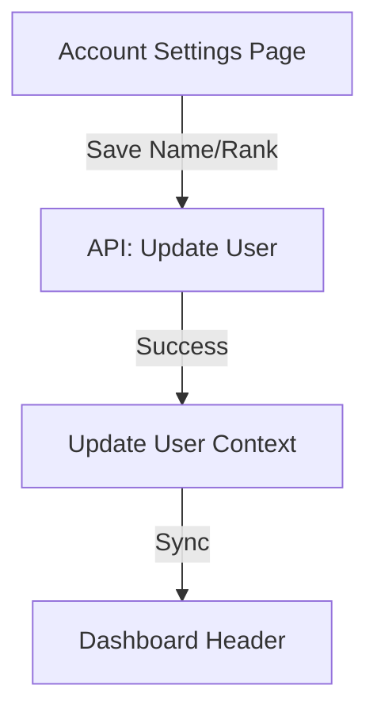

# Account Settings: Name & Rank Sync Improvement Plan

## Objective
Ensure that when a user updates their name and rank in Account settings, these changes are immediately reflected throughout the app, especially in the dashboard header (where "Alex Officer" is currently shown). Add a dropdown for selecting rank (officer, deputy, sergeant, etc.).

---

## 1. Backend Enhancements

- **User Model:**  
  - Ensure the User model includes a `rank` field (string, e.g., "officer", "deputy", "sergeant").
- **API:**  
  - Update the user update endpoint (`PUT /api/admin/users/:userId` or equivalent) to accept and persist `name` and `rank`.
  - Ensure the authenticated user can update their own profile (name, rank) via a secure endpoint.

---

## 2. Frontend: Account Settings

- **AccountPage.tsx:**  
  - Add a dropdown/select input for rank with options: Officer, Deputy, Sergeant, Lieutenant, Captain, Chief, etc.
  - Ensure the name and rank fields are editable.
  - On save, send both name and rank to the backend.
  - Show feedback (success/error) after saving.

---

## 3. Frontend: Dashboard Display

- **DashboardPage.tsx / DashboardCard.tsx:**  
  - Replace the hardcoded "Alex Officer" with the current user's name and rank from context or API.
  - Format: e.g., "Sergeant Jane Smith" or "Officer John Doe".
  - Ensure updates are reflected immediately after saving in Account settings (reactive context or refetch).

---

## 4. Data Flow & State Management

- Use React context or a global state (if available) to keep user info in sync across pages.
- After updating name/rank, update the context or refetch user data to reflect changes in the dashboard without requiring a full reload.

---

## 5. UX & Validation

- Validate name (non-empty, reasonable length).
- Validate rank (must be one of the allowed options).
- Add loading and error states for save actions.
- Optionally, add a toast/snackbar for success.

---

## 6. Accessibility

- Ensure all form fields have labels.
- Make the rank dropdown keyboard accessible.

---

## Mermaid Diagram: Data Flow

---

## Next Steps

1. Update the User model and backend API to support rank.
2. Add/edit name and rank fields in Account settings.
3. Update dashboard to display name and rank.
4. Ensure state/context sync and user feedback.