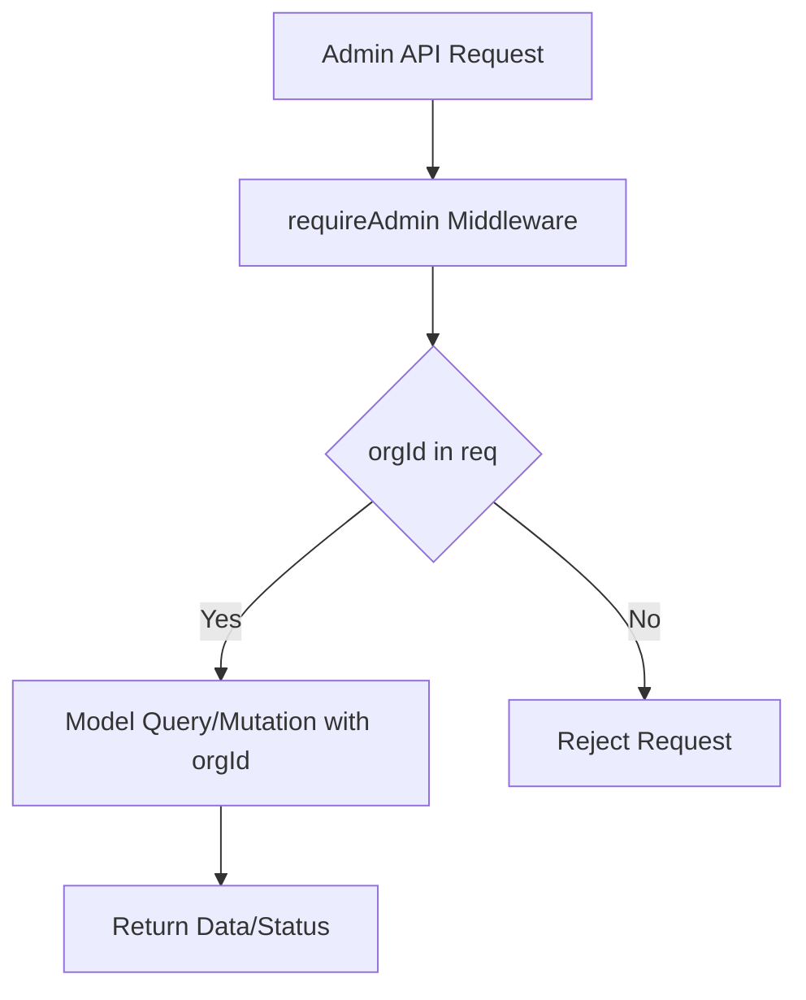

# Implementation Plan: Admin API Endpoints with Multi-Tenancy Enforcement

## Objective
Implement the admin API endpoints in `server/routes/admin.js` to enforce multi-tenancy and security, ensuring all operations are partitioned by `req.orgId` and scoped to the correct department.

---

## Endpoints and Model Usage

### 1. User Management (`/users`)
- **GET /users**: Query all users where `orgId === req.orgId`.
- **POST /users**: Create a new user with `orgId` set to `req.orgId` and user details from `req.body`.
- **PUT /users/:userId**: Update a user by `_id` and `orgId` (must match both).
- **DELETE /users/:userId**: Delete a user by `_id` and `orgId` (must match both).
- **Model**: `User` (from `src/database/models/User.js`)

### 2. Logs (`/logs`)
- **GET /logs**: Query logs where `orgId === req.orgId`.
- **Model**: `UsageLog` (from `src/database/models/UsageLog.js`)

### 3. Feature Flags (`/features`)
- **POST /features**: Set feature flags for a department or user.
- **Model**: _No model currently exists. Stub or create a `Feature` model if persistent storage is needed._

### 4. Analytics (`/analytics`)
- **GET /analytics**: Query analytics data partitioned by `orgId`.
- **Model**: _No model currently exists. Stub or create an `Analytics` model if persistent storage is needed._

---

## Multi-Tenancy Enforcement

- All queries and mutations must include `orgId: req.orgId` in their filter criteria.
- Never allow cross-tenant access by userId or other identifiers alone.
- Only users with `role=admin` (enforced by `requireAdmin` middleware) can access these endpoints.

---

## Example: User Query

```js
// GET /users
const users = await User.find({ orgId: req.orgId });
res.json({ users });
```

---

## Mermaid Diagram



---

## Next Steps

1. Implement `/users` endpoints using the `User` model and orgId partitioning.
2. Implement `/logs` endpoint using the `UsageLog` model and orgId partitioning.
3. Stub or plan for `/features` and `/analytics` endpoints (create models if needed).
4. Add automated tests for cross-tenant access and admin-only enforcement.