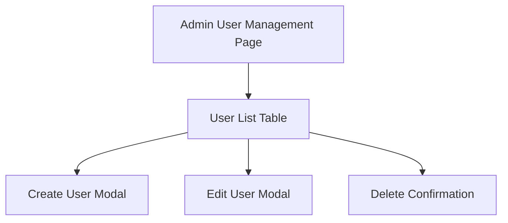

# Admin User Management UI Implementation Plan

## Objective
Build a secure, user-friendly admin interface for managing users within an organization. This UI will allow admins to view, create, edit, and delete users, supporting robust multi-tenancy and role-based access control.

---

## 1. Page & Route Setup
- Create a new page/component: `AdminUsersPage.tsx`.
- Add a protected route (e.g., `/admin/users`) accessible only to users with `role=admin`.
- Integrate with existing authentication and route protection logic.

---

## 2. User List Table
- Fetch users from the backend: `GET /api/admin/users`.
- Display users in a table with columns:
  - Name
  - Email
  - Role (admin/officer/etc.)
  - Status (active/inactive)
  - Actions (edit, delete)
- Add loading and error states for data fetching.

---

## 3. Create/Invite User
- Add a button to open a modal or form for creating a new user.
- Form fields:
  - Name
  - Email
  - Role (dropdown)
  - (Optional) Temporary password or invite link
- On submit, call `POST /api/admin/users`.
- Show success/error feedback (toast/snackbar).

---

## 4. Edit User
- Add an edit button for each user row.
- Open a modal or inline form to edit user details (role, status, etc.).
- On submit, call `PUT /api/admin/users/:userId`.
- Show feedback and update the table.

---

## 5. Delete/Deactivate User
- Add a delete button for each user row.
- Show a confirmation dialog before deleting.
- On confirm, call `DELETE /api/admin/users/:userId`.
- Remove the user from the table and show feedback.

---

## 6. Access Control & Security
- Ensure only admins can access the page and perform actions.
- Validate all actions on the backend for orgId and role.
- Hide or disable actions for the current admin (cannot delete self).

---

## 7. User Experience Enhancements
- Add search/filter functionality for large user lists.
- Paginate or virtualize the table for performance.
- Add tooltips, hover/focus states, and accessible labels.
- Show user avatars or initials for quick identification.

---

## 8. Future Enhancements (Optional)
- Support bulk user actions (invite, deactivate).
- Integrate email invites and password reset flows.
- Audit log for user management actions.

---

## Mermaid Diagram: User Management Flow

---

## Next Steps

1. Scaffold the `AdminUsersPage.tsx` and protected route.
2. Implement user list fetching and table display.
3. Add create, edit, and delete user functionality.
4. Test access control and user experience.
5. Iterate based on feedback and future needs.