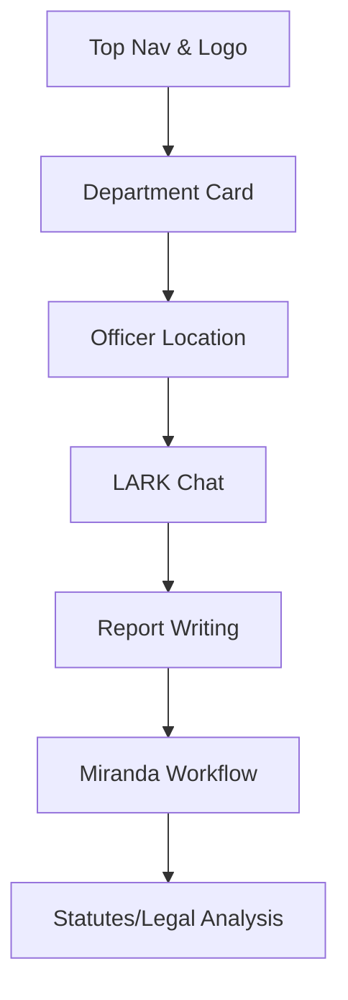

# Dashboard UI/UX Improvement Plan

## Objective
Enhance the usability, visual appeal, and accessibility of the LARK dashboard for a more intuitive and professional user experience.

---

## 1. Department Logo & Branding
- Replace the "Baton Rouge PD Logo" placeholder with the actual department logo if available.
- Ensure the logo is high-resolution and visually balanced with the department name.
- Add fallback logic for missing logos (e.g., initials or a default icon).

---

## 2. Visual Hierarchy & Section Headers
- Add clear, visually distinct section headers for each dashboard card (Officer Location, LARK Chat, Report Writing, Miranda Workflow, Statutes/Legal Analysis).
- Use icons or color accents for each section to improve scan-ability.
- Consider using a consistent card/header style for all sections.

---

## 3. Spacing, Padding, and Alignment
- Review and standardize padding and margin for all dashboard cards and content blocks.
- Ensure consistent alignment of text, buttons, and icons.
- Increase whitespace between major sections for clarity.

---

## 4. Responsive Design
- Test and refine dashboard layout for mobile and tablet breakpoints.
- Ensure all cards and controls are usable and visually appealing on smaller screens.
- Consider collapsible or stackable sections for mobile.

---

## 5. User Feedback & Interactivity
- Add loading indicators and error messages for async actions (e.g., chat, report writing, analytics).
- Use toasts or snackbars for success/error feedback.
- Add hover and focus states for interactive elements.

---

## 6. Accessibility
- Ensure all form fields and buttons have accessible labels.
- Add ARIA attributes where needed for screen readers.
- Support keyboard navigation for all interactive elements.

---

## 7. Quick Navigation & Collapsible Sections (Optional)
- Add a quick navigation bar or sidebar for jumping between dashboard sections.
- Allow users to collapse/expand dashboard cards for a cleaner view.

---

## 8. Theming & Customization (Future)
- Allow users or departments to customize dashboard theme (colors, background, etc.).
- Support light/dark mode toggle.

---

## Mermaid Diagram: Dashboard Structure

---

## Next Steps

1. Prioritize and implement the above improvements in code.
2. Review with stakeholders and iterate based on feedback.
3. Continue to monitor and enhance dashboard usability and accessibility.