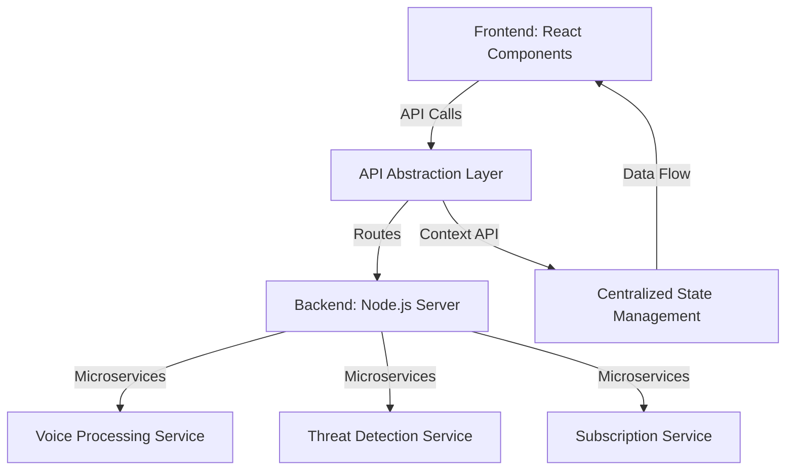
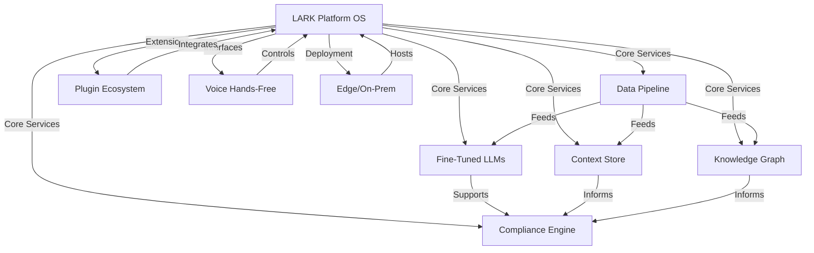

# LARK Development Plan

This document outlines the comprehensive strategy for the development and improvement of LARK (Law Enforcement Assistance and Response Kit), a specialized web application for law enforcement personnel. The plan addresses immediate enhancements to the existing codebase and a long-term vision for a proprietary, AI-driven platform. It incorporates the current deployment on Vercel and integration with Supabase.

## Part 1: Immediate Improvements to Existing Codebase
This section focuses on enhancing the current LARK application without disrupting existing functionality, addressing priorities for performance, UI/UX, architecture, and security.

### 1. Performance Optimization (Focus on Voice Processing Services)
- **Objective**: Reduce latency and improve responsiveness in voice processing for real-time interactions.
- **Steps**:
  1. Audit performance metrics for `VoiceRecognitionService.ts`, `VoiceSynthesisService.ts`, and `WhisperService.ts` using profiling tools to identify bottlenecks.
  2. Implement caching for frequently accessed voice data in `LiveKitVoiceService.ts` to minimize processing overhead.
  3. Refactor synchronous operations to asynchronous in voice services to enhance responsiveness.
  4. Optimize resource allocation for voice tasks, potentially integrating a load balancer for high-traffic scenarios.
  5. Conduct stress tests to validate optimizations under peak loads.

### 2. UI/UX Improvements for Dashboards and User Interaction Components
- **Objective**: Enhance user engagement and usability through improved design and interaction.
- **Steps**:
  1. Gather user feedback on `AdvancedDashboard.tsx` and `NewDashboard.tsx` to identify pain points.
  2. Ensure full responsiveness across devices for dashboard components.
  3. Redesign interaction components like `CommandButton.tsx` and `SuggestionsBar.tsx` for intuitiveness, adding animations for user feedback.
  4. Update UI for WCAG 2.1 compliance, focusing on accessibility features like keyboard navigation.
  5. Prototype redesigned dashboards and conduct A/B testing for validation.

### 3. Architectural Refactoring for Scalability and Maintainability
- **Objective**: Restructure the application to support growth and ease maintenance.
- **Steps**:
  1. Modularize services in `src/services` into independent microservices for scalability.
  2. Update dependencies in `package.json` to reduce technical debt.
  3. Centralize state management with `ConversationContext.tsx` to streamline data flow.
  4. Create a unified API abstraction layer to decouple frontend and backend, ensuring seamless integration with Supabase.
  5. Enhance documentation with architectural diagrams for clarity.

**Current Architecture Refactoring Diagram**:


### 4. Security Enhancements in Authentication and Data Handling
- **Objective**: Strengthen security to protect user data and prevent unauthorized access.
- **Steps**:
  1. Audit `auth.js` in `server/middleware` and `authService.ts` for robust JWT/OAuth2 implementation.
  2. Implement end-to-end encryption for sensitive data in `LiveKitVoiceService.ts`.
  3. Strengthen input validation across API endpoints in `server/routes` to prevent injection attacks.
  4. Add security headers in server responses to mitigate XSS vulnerabilities, considering Vercel’s hosting environment.
  5. Schedule periodic security audits and integrate vulnerability scanning in CI/CD.

## Part 2: Long-Term Strategy for Proprietary LARK Platform Development
This section outlines the creation of a new, isolated codebase for the proprietary LARK platform, ensuring no impact on the current app while building a defensible, industry-leading solution for law enforcement.

### 1. Isolated Codebase Setup
- **Objective**: Establish a separate repository for proprietary development.
- **Directory Structure**:
  ```
  lark-pro-core/
  ├── data_pipeline/
  │   ├── etl/
  │   ├── schemas/
  │   └── scripts/
  ├── models/
  │   ├── training/
  │   ├── evaluation/
  │   └── edge/
  ├── context_store/
  │   ├── api/
  │   ├── db/
  │   └── tests/
  ├── compliance_engine/
  │   ├── rules/
  │   ├── engine/
  │   └── ui/
  ├── knowledge_graph/
  │   ├── ingestion/
  │   ├── graphdb/
  │   └── apis/
  ├── plugins/
  │   ├── sdk/
  │   └── samples/
  ├── voice_handsfree/
  │   ├── wakeword/
  │   ├── commands/
  │   └── tests/
  ├── deployment/
  │   ├── docker/
  │   ├── k8s/
  │   └── scripts/
  ├── tests/
  ├── README.md
  └── .gitignore
  ```
- **Steps**:
  1. Create a new Git repository for `lark-pro-core` to isolate development.
  2. Set up the directory structure as outlined, ensuring clear separation of concerns.
  3. Initialize basic configuration files (e.g., `.gitignore`, CI/CD setup).

### 2. Proprietary Features and Strategic Differentiators
- **Objective**: Build unique, defensible features that set LARK apart from competitors.
- **Key Focus Areas**:
  1. **Proprietary Data Collection**: Develop pipelines in `data_pipeline/etl/` for ingesting and anonymizing law enforcement data (incident reports, chat logs, bodycam data).
  2. **Domain-Specific LLMs**: Fine-tune models in `models/training/` for report writing, compliance, and tactical advice using proprietary data.
  3. **Edge/Offline Capabilities**: Prototype smaller models in `models/edge/` for on-device inference.
  4. **Contextual Memory**: Build a context store in `context_store/` for persistent incident and officer context.
  5. **Compliance Engine**: Create a rules-based engine in `compliance_engine/` to evaluate actions against policies.
  6. **Knowledge Graph**: Develop a graph in `knowledge_graph/` for legal codes, policies, and incident outcomes.
  7. **Plugin Ecosystem**: Design SDKs and sample plugins in `plugins/` for third-party integrations.
  8. **Voice-Activated Operations**: Expand voice command coverage in `voice_handsfree/` for hands-free workflows.
  9. **Secure Deployment**: Prepare on-prem/edge deployment scripts in `deployment/` with end-to-end encryption, while maintaining compatibility with cloud hosting like Vercel.

**Long-Term Architecture Vision**:


### 3. AI-Driven Workflow and User Experience Innovations
- **Objective**: Enhance operational efficiency with AI-driven features.
- **Steps**:
  1. Develop conversation summarization and smart suggestions for real-time guidance.
  2. Create incident timeline visualizations for event tracking.
  3. Implement automated compliance checks with policy integration.
  4. Build real-time officer safety monitoring using biometric data.
  5. Design predictive policing tools for resource optimization.

### 4. Project Management and Team Roles
- **Objective**: Ensure structured development and clear accountability.
- **Steps**:
  1. Use a project management tool (e.g., GitHub Projects, Jira) to track tasks and sprints.
  2. Assign technical leads for each subsystem (e.g., Data Pipeline Lead, Models Lead).
  3. Schedule weekly standups and demos to review progress and address blockers.

### 5. Integration Strategy
- **Objective**: Seamlessly integrate mature modules into the main app over time.
- **Steps**:
  1. Test each subsystem in isolation within `lark-pro-core`.
  2. Gradually integrate stable modules (e.g., compliance engine) into the existing app as microservices.
  3. Maintain backward compatibility during integration to avoid disruptions.

## Game Plan Going Forward
- **Phase 1 (Immediate, 1-3 Months)**: Focus on immediate improvements to the existing codebase (performance, UI/UX, architecture, security). Set up the isolated `lark-pro-core` repository and build MVPs for data pipeline and context store.
- **Phase 2 (Mid-Term, 3-6 Months)**: Develop proprietary features like fine-tuned LLMs, compliance engine, and knowledge graph in the isolated codebase. Continue iterative improvements to the existing app based on user feedback.
- **Phase 3 (Long-Term, 6-12+ Months)**: Expand the plugin ecosystem, voice-activated operations, and edge deployment capabilities. Begin integrating stable proprietary modules into the main app, positioning LARK as a platform OS for law enforcement.

## Next Steps
With this plan documented, the next action is to switch to a mode suitable for implementation, starting with either immediate improvements to the existing codebase or setting up the new proprietary repository. The implementation phase will follow the phased approach outlined above, with regular check-ins to ensure alignment with the strategic vision.