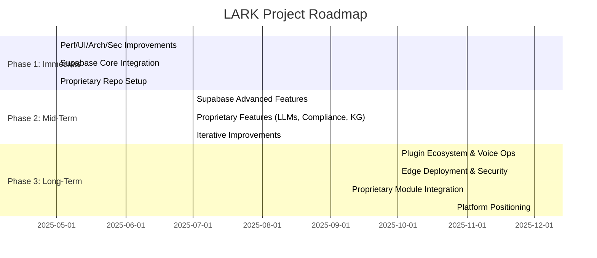

# LARK Project: Prioritized Actionable Roadmap

This roadmap synthesizes the Supabase integration plan and the LARK Development Plan, providing a clear, actionable, and phased approach for the next 12+ months. It is designed for implementation, communication, and tracking.

---

## **Synthesis Summary**

- **Supabase Integration Plan:** Focuses on authentication, database, storage, realtime, edge functions, vector search, and best practices for security and environment management.
- **LARK Development Plan:** Outlines immediate improvements (performance, UI/UX, architecture, security), a long-term vision for a proprietary, AI-driven platform, and a phased approach for platform evolution.

---

## **Phased Roadmap**

### **Phase 1: Immediate (1-3 Months)**
**Objectives:** Stabilize and enhance the current app, lay the foundation for future growth, and begin Supabase integration.

- **Performance Optimization**
  - Audit and profile voice services (`VoiceRecognitionService.ts`, `VoiceSynthesisService.ts`, `WhisperService.ts`)
  - Implement caching and async refactors in voice services
  - Stress test under peak loads

- **UI/UX Improvements**
  - Gather user feedback on dashboards (`AdvancedDashboard.tsx`, `NewDashboard.tsx`)
  - Redesign key interaction components for accessibility and responsiveness
  - Prototype and A/B test dashboard improvements

- **Architectural Refactoring**
  - Modularize services in `src/services` for future microservices
  - Centralize state management (`ConversationContext.tsx`)
  - Update dependencies and improve documentation
  - Create a unified API abstraction layer to decouple frontend/backend and prepare for Supabase

- **Security Enhancements**
  - Audit authentication and middleware (`server/middleware/auth.js`, `authService.ts`)
  - Implement end-to-end encryption for sensitive data
  - Strengthen input validation and add security headers
  - Integrate vulnerability scanning in CI/CD

- **Supabase Integration (Foundational)**
  - Set up Supabase project and environment management
  - Implement authentication (JWT/OAuth2), database, and storage integration
  - Apply Supabase security best practices

- **Proprietary Platform Foundation**
  - Create new isolated repository (`lark-pro-core`)
  - Set up directory structure and initialize configuration
  - Build MVPs for data pipeline and context store

---

### **Phase 2: Mid-Term (3-6 Months)**
**Objectives:** Advance proprietary features, deepen Supabase integration, and iterate on user feedback.

- **Supabase Advanced Features**
  - Integrate realtime, edge functions, and vector search
  - Optimize Supabase usage for scalability and cost

- **Proprietary Features**
  - Develop and fine-tune domain-specific LLMs
  - Build compliance engine and knowledge graph
  - Prototype edge/offline capabilities

- **Iterative Improvements**
  - Continue UI/UX and performance enhancements based on user feedback
  - Expand test coverage and documentation

- **Team and Project Management**
  - Assign technical leads for subsystems
  - Use project management tools for tracking and accountability

---

### **Phase 3: Long-Term (6-12+ Months)**
**Objectives:** Expand platform capabilities, integrate proprietary modules, and position LARK as a platform OS.

- **Plugin Ecosystem and Voice Operations**
  - Develop SDKs and sample plugins
  - Expand voice-activated workflows

- **Edge Deployment and Security**
  - Prepare on-prem/edge deployment scripts
  - Ensure end-to-end encryption and compliance

- **Integration of Proprietary Modules**
  - Gradually integrate stable modules (e.g., compliance engine) into the main app as microservices
  - Maintain backward compatibility

- **AI-Driven Workflow Innovations**
  - Implement conversation summarization, incident timeline visualizations, and predictive tools

- **Platform Positioning**
  - Market LARK as a platform OS for law enforcement
  - Gather feedback and iterate on platform features

---

## **Milestones and Metrics**

| Phase      | Key Actions                                                                 | Milestone Example                                  | Metrics/KPIs                        |
|------------|-----------------------------------------------------------------------------|----------------------------------------------------|-------------------------------------|
| 1 (1-3mo)  | Perf/UI/Arch/Sec improvements, Supabase core, repo setup                    | Supabase auth live, MVP data pipeline in place     | Latency, auth success, code health  |
| 2 (3-6mo)  | Supabase advanced, LLMs, compliance, knowledge graph                        | Realtime/edge live, compliance engine prototype    | Feature usage, model accuracy       |
| 3 (6-12mo) | Plugins, voice ops, edge, integrate proprietary modules, platform positioning| Plugin SDK released, edge deployment tested        | Adoption, uptime, user feedback     |

---

## **Best Practices**

- **Security & Compliance:** Integrate security reviews and compliance checks into every sprint.
- **Documentation:** Maintain up-to-date documentation for architecture, APIs, and onboarding.
- **Testing:** Adopt TDD for new features and refactors. Expand automated test coverage.
- **CI/CD:** Use continuous integration and deployment pipelines.
- **Stakeholder Engagement:** Schedule bi-weekly demos and establish feedback channels.
- **Risk Management:** Run proprietary platform work in parallel, conduct integration testing, and communicate major changes.

---

## **Visual Roadmap**

---

## **Kickoff Checklist**

- [ ] Review and confirm roadmap with all stakeholders
- [ ] Assign technical leads and clarify team roles
- [ ] Set up project management tooling (e.g., GitHub Projects, Jira)
- [ ] Schedule regular standups, demos, and roadmap reviews
- [ ] Begin Phase 1 tasks as outlined

---

**This roadmap is ready for implementation and communication. Update as progress is made and priorities evolve.**
