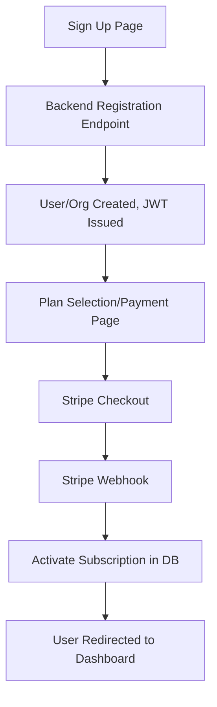

# Detailed Implementation Plan: Signup, Onboarding, and Payments

## 1. Overview

**Goal:**  
Enable secure, user-friendly self-signup and onboarding for new users and organizations, with integrated payment handling for subscriptions using Stripe.

---

## 2. Architecture & Flow

### High-Level Flow

---

## 3. Implementation Steps

### A. Signup & Onboarding

#### Frontend
- Add a **Sign Up** page with registration form:
  - Fields: Name, Email, Password, Department/Org Name, Rank, (optional: invite code)
  - Option to select a subscription plan (if required before account creation)
- Add navigation to signup from login.
- On submit, call backend registration endpoint.
- After signup, redirect to payment or dashboard.

#### Backend
- Expose public registration endpoint (`POST /api/auth/register-public`):
  - Accepts user/org info, validates input, hashes password.
  - Creates new org and user, or adds user to existing org (if invite code).
  - Issues JWT on success.
  - Optionally, send email verification or admin approval.
- **Security:**
  - Prevent duplicate accounts (unique email/org).
  - Rate limit registration endpoint.
  - Validate and sanitize all input.

---

### B. Payments Integration

#### Best Practices
- Use Stripe for subscriptions/payments.
- Never store raw card data.
- Use Stripe Checkout/Elements for PCI compliance.

#### Flow
- After signup, redirect to payment/plan selection.
- Use Stripe Checkout to create a session for the selected plan.
- On payment success, Stripe calls webhook to activate subscription.
- Update user/org status in DB on webhook event.
- Allow users to manage billing via Stripe customer portal.

#### Implementation Steps

**Frontend:**
- Add plan selection/payment page after signup.
- Integrate Stripe Checkout (redirect to Stripe for payment).
- Show payment status and next steps after payment.

**Backend:**
- Endpoint to create Stripe Checkout session (`POST /api/subscription/create-checkout-session`).
- Stripe webhook endpoint to handle payment events and activate subscriptions.
- Store Stripe customer/subscription IDs in DB.
- Enforce subscription status for premium features.

---

### C. Dev/Prod Parity & Security

- Remove/gate auto-login dev user for production.
- Ensure app starts on login/signup if not authenticated.
- Use env variables for Stripe keys/secrets.
- Test with Stripe's test mode before going live.

---

### D. Optional Enhancements

- Support invite-only orgs or admin approval.
- Email verification for new accounts.
- Free trial period before requiring payment.
- In-app upgrade/downgrade/cancel subscription options.

---

## 4. Task Breakdown & Dependencies

| Step | Task | Dependencies | Owner (suggested) |
|------|------|--------------|-------------------|
| 1 | Scaffold signup page (frontend) | None | Frontend |
| 2 | Scaffold backend registration endpoint | None | Backend |
| 3 | Add navigation to signup | 1 | Frontend |
| 4 | Implement input validation & security | 2 | Backend |
| 5 | Integrate Stripe Checkout (frontend) | 1, 2 | Frontend |
| 6 | Create Stripe session endpoint | 2 | Backend |
| 7 | Implement Stripe webhook | 6 | Backend |
| 8 | Store Stripe IDs in DB | 7 | Backend |
| 9 | Enforce subscription status | 8 | Backend |
| 10 | Add Stripe customer portal link | 8 | Frontend |
| 11 | Test full flow (dev/staging) | 1-10 | QA/Dev |
| 12 | Launch & monitor | 11 | DevOps |

---

## 5. Security & Compliance Checklist

- [ ] All sensitive data validated and sanitized
- [ ] Passwords hashed (bcrypt or argon2)
- [ ] JWT securely signed and stored
- [ ] Stripe keys/secrets in env variables
- [ ] No raw card data stored
- [ ] Rate limiting on registration endpoint
- [ ] Email verification (optional/rec)
- [ ] Webhook endpoint secured (Stripe signature verification)

---

## 6. Next Steps

1. Scaffold the signup page and backend registration endpoint.
2. Integrate Stripe Checkout for payments.
3. Implement Stripe webhook and subscription activation logic.
4. Test the full flow in dev and staging.
5. Launch and monitor for issues.