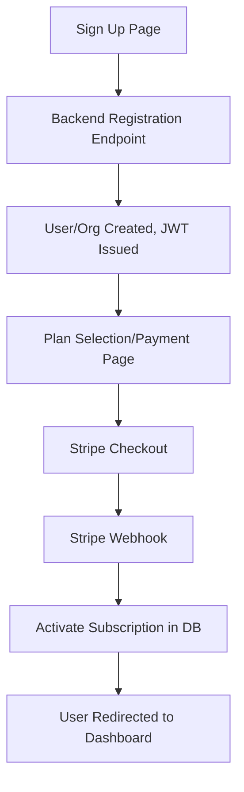

# Signup, Onboarding, and Payments Implementation Plan

## Objective
Enable secure, user-friendly self-signup and onboarding for new users and organizations, with integrated payment handling for subscriptions.

---

## 1. Signup & Onboarding Flow

### Frontend
- Add a "Sign Up" page with a registration form:
  - Fields: Name, Email, Password, Department/Org Name, Rank, (optional: invite code)
  - Option to select a subscription plan (if required before account creation)
- Add navigation to the signup page from the login screen.
- On submit, call the backend registration endpoint.
- After successful signup, redirect to payment (if required) or dashboard.

### Backend
- Expose a public registration endpoint (e.g., `POST /api/auth/register-public`):
  - Accepts user and org info, validates input, hashes password.
  - Creates a new org and user, or adds user to existing org (if invite code provided).
  - Issues JWT on success.
  - Optionally, send email verification or admin approval flow.

- **Security:**
  - Prevent duplicate accounts (unique email/org).
  - Rate limit registration endpoint.
  - Validate all input and sanitize.

---

## 2. Payments Integration

### Best Practices
- Use a trusted payment provider (e.g., Stripe) for handling subscriptions and payments.
- Never store raw credit card data on your servers.
- Use Stripe Checkout or Stripe Elements for PCI compliance and a smooth UX.

### Flow
- After signup, redirect user to a payment/plan selection page.
- Use Stripe Checkout to create a session for the selected plan.
- On successful payment, Stripe calls your webhook to activate the subscription.
- Update user/org status in your database on webhook event.
- Allow users to manage billing via a customer portal (Stripe-hosted).

### Implementation Steps
- **Frontend:**
  - Add a plan selection/payment page after signup.
  - Integrate Stripe Checkout (redirect to Stripe for payment).
  - Show payment status and next steps after payment.

- **Backend:**
  - Endpoint to create Stripe Checkout session (`POST /api/subscription/create-checkout-session`).
  - Stripe webhook endpoint to handle payment events and activate subscriptions.
  - Store Stripe customer/subscription IDs in your database.
  - Enforce subscription status for access to premium features.

---

## 3. Dev/Prod Parity & Security

- Remove or gate auto-login dev user for production.
- Ensure app starts on login/signup if not authenticated.
- Use environment variables for Stripe keys and secrets.
- Test with Stripe's test mode before going live.

---

## 4. Optional Enhancements

- Support for invite-only orgs or admin approval.
- Email verification for new accounts.
- Free trial period before requiring payment.
- In-app upgrade/downgrade/cancel subscription options.

---

## Mermaid Diagram: Signup & Payment Flow

---

## Next Steps

1. Scaffold the signup page and backend registration endpoint.
2. Integrate Stripe Checkout for payments.
3. Implement Stripe webhook and subscription activation logic.
4. Test the full flow in dev and staging.
5. Launch and monitor for issues.