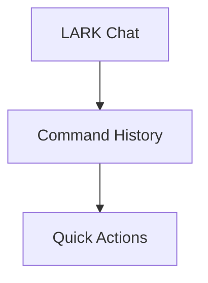
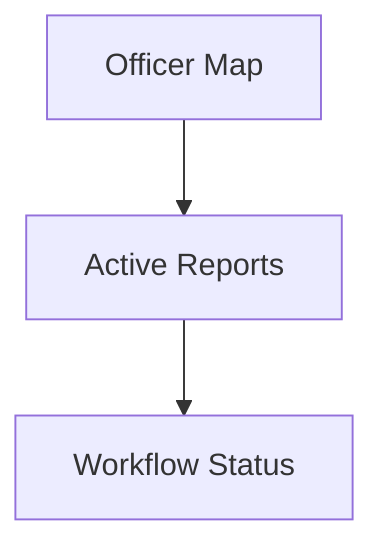
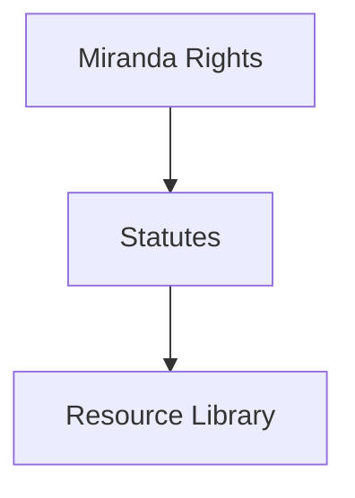
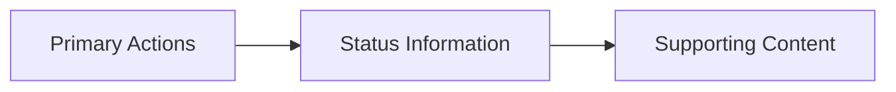

# LARK Dashboard Layout Redesign Plan

## Current Pain Points
1. Widgets don't effectively utilize available space
2. Layout doesn't reflect natural workflow priorities
3. Limited visual hierarchy
4. Inconsistent widget sizes
5. Navigation between widgets could be more intuitive

## Proposed Layout Design

### 1. Primary Command Center (Left Column - 30%)

- **LARK Chat**: Expanded, full-height interface
  - Larger message display area
  - Integrated voice controls
  - Real-time transcription display
  - Quick-access command palette
- **Command History**: Collapsible timeline
- **Quick Actions**: Contextual action buttons

### 2. Main Workspace (Center Column - 40%)

- **Officer Map**: Interactive with key locations
  - Incident markers
  - Backup locations
  - Resource availability
- **Active Reports**: Tabbed interface
  - Current report
  - Recent reports
  - Templates
- **Workflow Status**: Progress indicators

### 3. Context & Resources (Right Column - 30%)

- **Miranda Rights**: Collapsible workflow
  - Language selection
  - Step-by-step guide
  - Confirmation tracking
- **Statutes**: Searchable database
  - Quick filters
  - Recent lookups
  - Bookmarks
- **Resource Library**: Quick access panel

## Key Improvements

### 1. Spatial Organization
- Fixed column layout for better predictability
- Height-based priority (most important at top)
- Collapsible sections for space management
- Persistent chat interface

### 2. Interaction Design
- Drag handles only on section headers
- Snap-to-grid for easier organization
- Context-aware widget expansion
- Touch-friendly interaction zones

### 3. Visual Hierarchy

- Color-coded importance levels
- Size-based emphasis
- Clear visual grouping
- Consistent styling

### 4. Responsive Behavior
- Column stacking on smaller screens
- Priority-based content display
- Collapsible sections
- Touch-optimized controls

### 5. Performance Optimizations
- Lazy loading for off-screen content
- Progressive enhancement
- Efficient re-rendering
- Optimized animations

## Implementation Approach

### Phase 1: Core Layout
1. Implement fixed column structure
2. Add basic widget containers
3. Set up responsive breakpoints
4. Establish grid system

### Phase 2: Widget Enhancement
1. Redesign individual widgets
2. Implement collapsible sections
3. Add drag-and-drop functionality
4. Optimize widget interactions

### Phase 3: Visual Refinement
1. Apply consistent styling
2. Add transitions and animations
3. Implement dark/light themes
4. Polish interaction states

### Phase 4: Performance & Testing
1. Optimize rendering
2. Add loading states
3. Implement error boundaries
4. Conduct usability testing

## Technical Considerations

### Layout System
```typescript
interface LayoutConfig {
  columns: {
    id: string;
    width: string;
    priority: number;
    minWidth?: string;
  }[];
  breakpoints: {
    mobile: number;
    tablet: number;
    desktop: number;
  };
}
```

### Widget Architecture
```typescript
interface Widget {
  id: string;
  type: WidgetType;
  priority: number;
  state: {
    collapsed: boolean;
    height: number;
    loading: boolean;
  };
  content: ReactNode;
}
```

### Styling Strategy
- CSS Grid for main layout
- Flexbox for widget internals
- CSS Variables for theming
- Tailwind utilities for consistency

## Success Metrics
1. Reduced interaction time for common tasks
2. Improved widget visibility scores
3. Decreased error rates in data entry
4. Higher user satisfaction ratings
5. Better performance metrics

## Next Steps
1. Review design proposal with stakeholders
2. Create high-fidelity prototypes
3. Conduct user testing sessions
4. Begin phased implementation
5. Gather user feedback